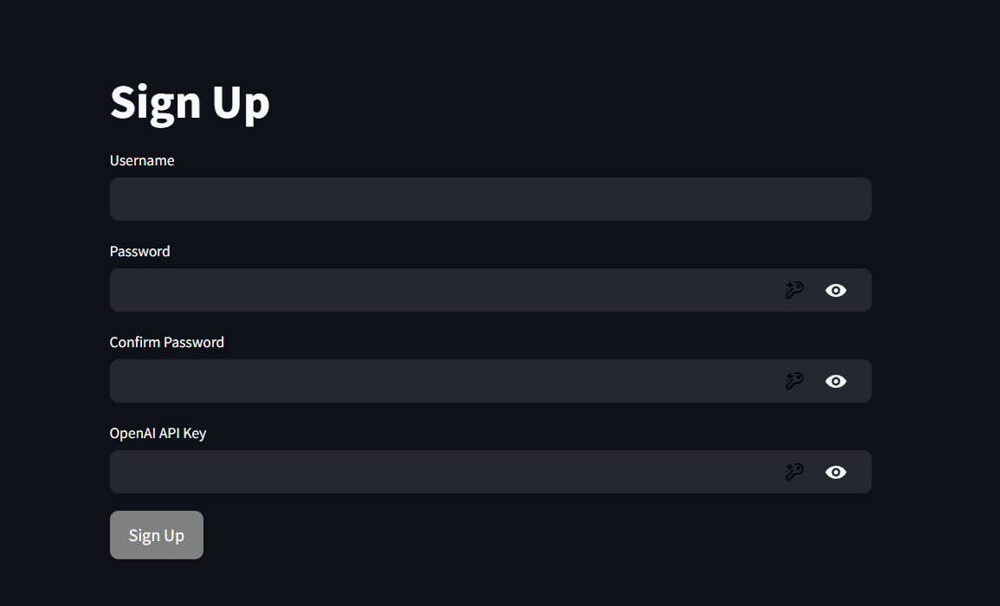
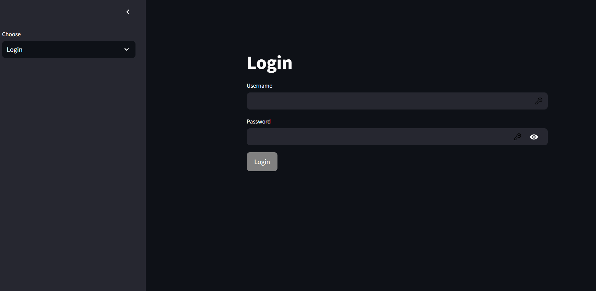
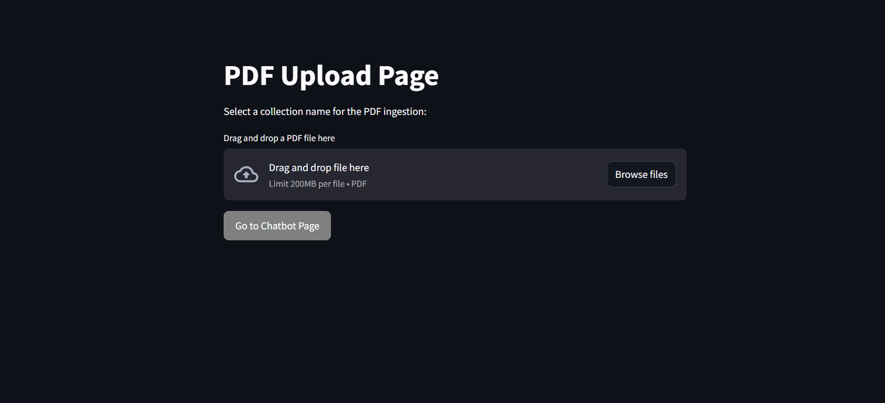
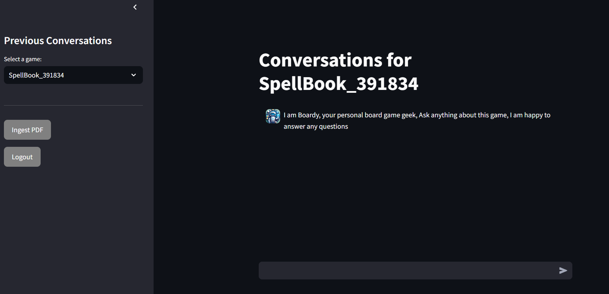
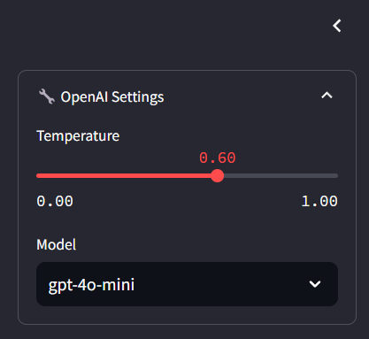
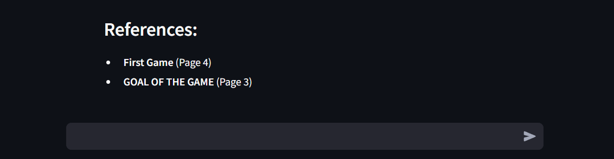
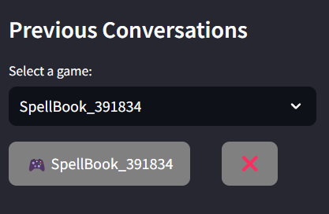
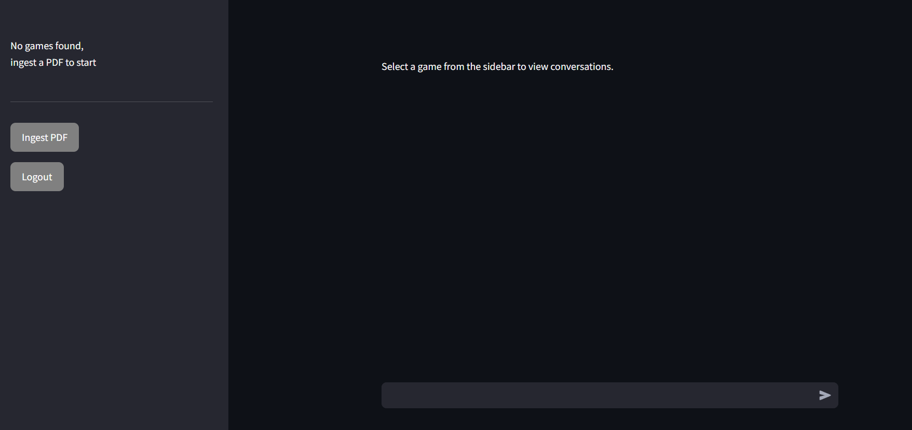

# RAG for board games

## Requirements
Openai API key is needed, docker facilitates to run the app, otherwise install mongoDB and Qdrant locally and change settings to get access to these two locally

## Overview
This application is designed to help users interact with board game rulebooks efficiently. By uploading a PDF file of a game's rules, users can ask questions, retrieve saved chats, and reference game details with ease.

## Features
- **User Authentication:** Secure sign-up and login process to manage user accounts.
- **PDF Upload:** Ingest board game rulebooks in PDF format.
- **Interactive Q&A:** Start with initial questions to guide user interaction.
- **Saved Chats:** View, retrieve, and delete past chat sessions based on ingested files.
- **Reference Management:** Easily reference specific details from uploaded games.
- **No Library Handling:** Clearly indicates when no games have been ingested.

## Getting Started

## How to Start the Project with Docker

1. **Create external network:**
   ```bash
   docker network create rag_bgg_rag_network
   
2. **Build and run image:**
   ```bash
   docker-compose up --build

3. **If image is already built run**
   ```bash
   docker-compose up

4. **Access streamlit at**
   ```bash
   http://localhost:8501/

#### Required at least 8Gb of RAM given to docker


# APP functionalities

### Sign Up
Users need to create an account before accessing the app.



### Login
Log in with your credentials to start using the app.



### Upload PDF
After logging in, upload a PDF file containing the board game rules.



### Start Questions
Begin your interaction with the app by answering initial questions.



### Adjust Yuor Bot
Switch your openai bot and temperature




### Reference Feature
Access detailed references from the ingested game rules.



### Saved Chats
View your saved chats, retrieve them based on file names, or delete them if no longer needed.



### No Libraries
If no games are ingested, the app will notify you accordingly.


